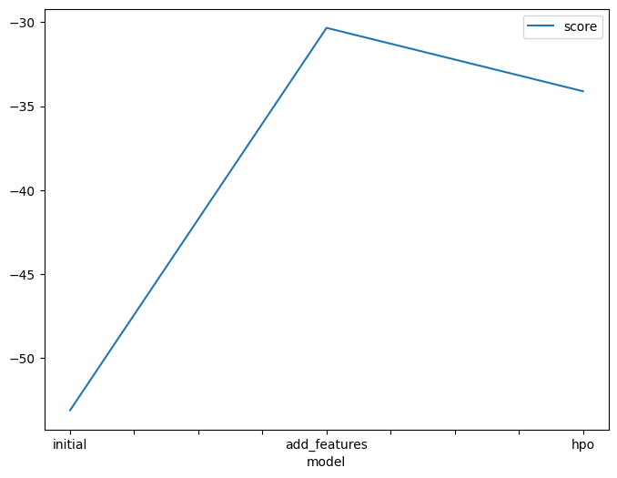
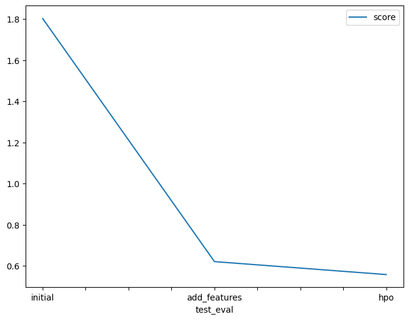

# Report: Predict Bike Sharing Demand with AutoGluon Solution
#### Afras Aboobacker P

## Initial Training
### What did you realize when you tried to submit your predictions? What changes were needed to the output of the predictor to submit your results?
I encountered some syntax errors and had to refer to additional documentation to correct them and ensure that the model runs as intended. Initially, when I used the raw dataset without conducting any data analysis or feature engineering, the model did not perform as well as expected and had a lot of error.

### What was the top ranked model that performed?
The top-ranked model that performed well was the WeightedEnsemble_L2 model. The WeightedEnsemble_L2 is a model in AutoGluon that combines the predictions of multiple individual models, weighted by their performance. It uses an ensemble technique to improve the overall predictive power. In the context of your specific model, the WeightedEnsemble_L2 model outperformed other individual models and achieved better accuracy or predictive performance.

## Exploratory data analysis and feature creation
### What did the exploratory analysis find and how did you add additional features?
For the extra features I divided the datetime in month, day, year and hour. Also it was usefull to transform the season and weather features to categorical

### How much better did your model preform after adding additional features and why do you think that is?
The split of the datetime field into year, month, day, and hour resulted in a significant improvement in the model's performance. The root mean squared error (RMSE) decreased from -53.118942 to -30.335978, indicating a substantial reduction in the prediction error.

## Hyper parameter tuning
### How much better did your model preform after trying different hyper parameters?
Hyperparameter tuning had a mixed impact on the model performance. While it was beneficial in some cases, it did not significantly improve the overall performance of the model. Some hyperparameter configurations proved to be useful, while others had a negative impact on the model's performance.

### If you were given more time with this dataset, where do you think you would spend more time?
Do a more extensive data analysis in order to get more information about this dataset , and do more research about the hyperparameters

### Create a table with the models you ran, the hyperparameters modified, and the kaggle score.
|model|hpo1|hpo2|hpo3|score|
|--|--|--|--|--|
|initial|default_vals|default_vals|efault_vals	|1.79594|
|add_features|default_vals|default_vals|default_vals|0.63634|
|hpo|GBM (Light gradient boosting) : num_boost_round: [lower=100, upper=500], num_leaves:[lower=6, upper=10], learning_rate:[lower=0.01, upper=0.3, log scale]|XGB (XGBoost): n_estimators : [lower=100, upper=500], max_depth : [lower=6, upper=10], eta(learning_rate) : [lower=0.01, upper=0.3, log scale]|NN (neural network) = num_epochs: 10,layers:([100], [1000], [200, 100], [300, 200, 100]),learning_rate:[lower=0.0001,upper=0.01],dropout_prob:[0.0, 0.5],activation_fun:[relu, tanh]|0.55740|

### Create a line plot showing the top model score for the three (or more) training runs during the project.

### Create a line plot showing the top kaggle score for the three (or more) prediction submissions during the project.

## Summary
In summary, this project highlighted the significance of both feature engineering and hyperparameter optimization in the machine learning workflow. It demonstrated that it is an iterative process, where we alternate between extracting new features from the available data, performing exploratory data analysis, and trying different models with the new features. This iterative approach helps us gradually improve the model's performance by iteratively refining the features and tuning the hyperparameters until we achieve satisfactory validation and test errors.
